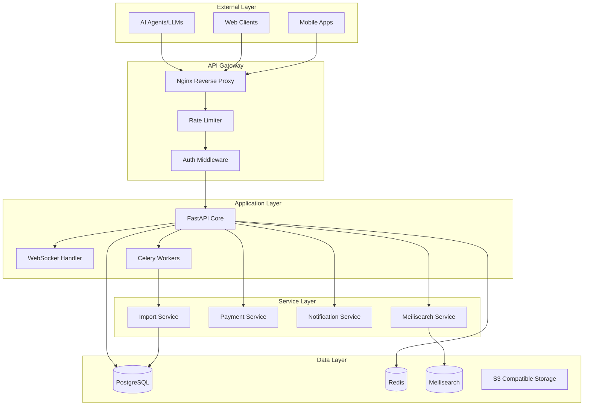

# Product Requirements Document (PRD)
## n8n Template Marketplace Platform

**Version:** 1.0  
**Date:** December 2024  
**Status:** Draft

---

## 1. Executive Summary

### 1.1 Product Vision
A self-hosted, AI-agent friendly marketplace that connects businesses needing n8n automation with expert freelancers, while providing instant access to 2000+ templates through lightning-fast search powered by Meilisearch.

### 1.2 Key Differentiators
- **100% Self-Hosted**: No vendor lock-in (no Supabase, no SaaS dependencies)
- **AI-First Architecture**: Built for LLM/agent consumption
- **Brazilian Market Focus**: Mercado Pago PIX integration, LGPD compliant
- **Lightweight Design**: 4 tables vs 40+ in traditional e-commerce platforms

### 1.3 Tech Stack Clarification
**Current Architecture (FastAPI):**
- Backend: FastAPI (Python) - NOT Medusa.js
- Search: Meilisearch (native integration)
- Database: PostgreSQL
- Cache: Redis
- Deploy: Docker Compose

**Meilisearch Integration:** Direct integration via `meilisearch-python-async` library - no compatibility issues.

---

## 2. Identified Issues & Risk Analysis 🚨

### 2.1 Critical Issues (P0)

#### Missing Core Components
```python
# Referenced but not implemented:
- routers/templates.py
- routers/freelancers.py
- routers/search.py
- routers/webhooks.py
- routers/auth.py
- routers/payments.py
- services/meilisearch_service.py
- services/ai_assistant.py
```
**Impact:** Application won't run without these modules  
**Resolution:** Must implement all router and service modules

#### Security Vulnerabilities
```python
# CORS allows all origins
allow_origins=["*"]  # CRITICAL: Configure for production

# Missing rate limiting
# No API key authentication for public endpoints
# JWT implementation incomplete
```
**Impact:** API vulnerable to abuse, DDoS  
**Resolution:** Implement proper CORS, rate limiting, API keys

### 2.2 High Priority Issues (P1)

#### Database Migration Strategy
- No Alembic migrations setup
- `Base.metadata.create_all()` drops existing data on schema changes
- No backup/restore procedures

**Resolution:**
```python
# Add to requirements.txt
alembic==1.13.1

# Initialize migrations
alembic init migrations
```

#### Payment Integration Gaps
- Webhook handlers not implemented
- No idempotency keys for payments
- Missing refund flow
- No payment reconciliation

### 2.3 Medium Priority Issues (P2)

#### Monitoring & Observability
- No structured logging
- Missing APM integration
- No health check depth (DB, Redis, Meilisearch)
- No metrics collection

#### Frontend Missing
- Next.js frontend referenced but not included
- No admin dashboard
- No freelancer portal

### 2.4 Performance Considerations

#### Meilisearch Indexing
```python
# Current: Synchronous indexing on startup
asyncio.create_task(importer.import_from_github())  # Fire and forget

# Issue: No progress tracking, error handling
```

#### N+1 Query Problems
```python
# Potential N+1 in relationships
implementations = relationship("Implementation", back_populates="template")
# Need eager loading strategy
```

---

## 3. Improved Architecture Plan 🏗️

### 3.1 Service Architecture



### 3.2 Database Schema Improvements

```sql
-- Add audit fields
ALTER TABLE templates ADD COLUMN 
    import_source VARCHAR(50),
    import_batch_id UUID,
    is_active BOOLEAN DEFAULT true,
    metadata JSONB DEFAULT '{}';

-- Add indexes for performance
CREATE INDEX idx_templates_category_active ON templates(category, is_active);
CREATE INDEX idx_templates_tags ON templates USING GIN(tags);
CREATE INDEX idx_freelancers_skills ON freelancers USING GIN(skills);

-- Add payment tracking
CREATE TABLE payment_transactions (
    id SERIAL PRIMARY KEY,
    implementation_id INTEGER REFERENCES implementations(id),
    transaction_id VARCHAR(255) UNIQUE,
    payment_method VARCHAR(50),
    amount DECIMAL(10,2),
    currency VARCHAR(10),
    status VARCHAR(50),
    idempotency_key UUID UNIQUE,
    webhook_payload JSONB,
    created_at TIMESTAMP DEFAULT CURRENT_TIMESTAMP,
    updated_at TIMESTAMP DEFAULT CURRENT_TIMESTAMP
);

-- Add API usage tracking
CREATE TABLE api_usage (
    id SERIAL PRIMARY KEY,
    api_key VARCHAR(255),
    endpoint VARCHAR(255),
    method VARCHAR(10),
    response_code INTEGER,
    response_time_ms INTEGER,
    ip_address INET,
    user_agent TEXT,
    created_at TIMESTAMP DEFAULT CURRENT_TIMESTAMP
);
```

---

## 4. Implementation Roadmap 📋

### Phase 1: Core Foundation (Week 1-2)
**Goal:** Get basic API running

- [ ] Implement missing routers
- [ ] Create Meilisearch service
- [ ] Setup authentication (JWT)
- [ ] Database migrations with Alembic
- [ ] Basic error handling
- [ ] API documentation

### Phase 2: Search & Discovery (Week 3)
**Goal:** Lightning-fast template search

- [ ] Meilisearch index optimization
- [ ] Faceted search implementation
- [ ] Synonym configuration (PT-BR)
- [ ] Search analytics
- [ ] AI-powered recommendations

### Phase 3: Payment Integration (Week 4)
**Goal:** Secure payment processing

- [ ] Mercado Pago webhook handlers
- [ ] Payment status tracking
- [ ] Refund flow
- [ ] Commission calculation
- [ ] Invoice generation

### Phase 4: Freelancer Platform (Week 5)
**Goal:** Connect clients with experts

- [ ] Freelancer onboarding
- [ ] Portfolio management
- [ ] Proposal system
- [ ] Rating & reviews
- [ ] Messaging system

### Phase 5: Production Hardening (Week 6)
**Goal:** Production-ready deployment

- [ ] Rate limiting (Redis-based)
- [ ] API key management
- [ ] Monitoring (Prometheus/Grafana)
- [ ] Log aggregation (ELK stack)
- [ ] Backup automation
- [ ] SSL/TLS configuration
- [ ] CDN integration

---

## 5. API Specification

### 5.1 Core Endpoints

```yaml
# Template Management
GET    /api/templates              # List templates (paginated)
GET    /api/templates/{id}         # Get template details
POST   /api/templates/import       # Trigger import
GET    /api/templates/count        # Get total count

# Search (Meilisearch powered)
POST   /api/search                 # Full-text search
GET    /api/search/facets          # Get search facets
POST   /api/search/suggest         # Autocomplete

# AI Agent Interface
POST   /api/ai/query               # Natural language query
POST   /api/ai/action              # Structured action
POST   /api/ai/bulk                # Bulk operations
GET    /api/ai/context/{session}   # Get conversation context

# Freelancer Management
GET    /api/freelancers            # List freelancers
GET    /api/freelancers/{id}       # Get profile
POST   /api/freelancers/apply      # Apply to project
PUT    /api/freelancers/{id}       # Update profile

# Implementation Requests
POST   /api/implementations        # Create request
GET    /api/implementations/{id}   # Get details
PUT    /api/implementations/{id}   # Update status
POST   /api/implementations/{id}/accept  # Freelancer accepts

# Payments
POST   /api/payments/create        # Initialize payment
POST   /api/payments/webhook       # Handle webhooks
GET    /api/payments/{id}/status   # Check status
POST   /api/payments/{id}/refund   # Process refund
```

### 5.2 Authentication Flow

```python
# JWT Token Structure
{
    "sub": "user_id",
    "email": "user@example.com",
    "role": "freelancer|client|admin",
    "exp": 1234567890,
    "iat": 1234567890,
    "jti": "unique_token_id"
}

# API Key for AI Agents
Headers:
  X-API-Key: "mk_live_xxxxxxxxxxxxx"
  X-API-Secret: "ms_xxxxxxxxxxxxx"
```

---

## 6. Monitoring & Success Metrics

### 6.1 Technical KPIs
- API Response Time: < 200ms (p95)
- Search Response Time: < 50ms (p95)
- Uptime: 99.9%
- Error Rate: < 0.1%
- Database Query Time: < 100ms (p95)

### 6.2 Business KPIs
- Templates Imported: 2000+
- Search Queries/Day: Target 10,000
- Freelancer Signups: 100/month
- Implementation Requests: 50/month
- Payment Success Rate: > 95%

### 6.3 Monitoring Stack
```yaml
services:
  prometheus:
    image: prom/prometheus
    volumes:
      - ./prometheus.yml:/etc/prometheus/prometheus.yml
    
  grafana:
    image: grafana/grafana
    environment:
      - GF_SECURITY_ADMIN_PASSWORD=admin
    
  loki:
    image: grafana/loki
    
  tempo:
    image: grafana/tempo
```

---

## 7. Security Requirements

### 7.1 Authentication & Authorization
- [x] JWT for session management
- [ ] OAuth2 for third-party integration
- [ ] API key rotation mechanism
- [ ] Role-based access control (RBAC)

### 7.2 Data Protection
- [ ] Encryption at rest (PostgreSQL)
- [ ] Encryption in transit (TLS 1.3)
- [ ] PII data masking in logs
- [ ] LGPD compliance for Brazilian users

### 7.3 API Security
```python
# Rate Limiting Configuration
RATE_LIMITS = {
    "anonymous": "100/hour",
    "authenticated": "1000/hour",
    "premium": "10000/hour",
    "ai_agent": "5000/hour"
}

# CORS Configuration (Production)
ALLOWED_ORIGINS = [
    "https://app.n8n-marketplace.com",
    "https://api.n8n-marketplace.com"
]
```

---

## 8. Testing Strategy

### 8.1 Test Coverage Requirements
- Unit Tests: 80% coverage
- Integration Tests: Critical paths
- Load Tests: 1000 concurrent users
- Security Tests: OWASP Top 10

### 8.2 Test Implementation
```python
# pytest.ini
[tool:pytest]
testpaths = tests
python_files = test_*.py
python_classes = Test*
python_functions = test_*
asyncio_mode = auto

# Example test
async def test_template_search():
    async with AsyncClient(app=app, base_url="http://test") as client:
        response = await client.post("/api/search", json={
            "query": "gmail automation",
            "limit": 10
        })
        assert response.status_code == 200
        assert len(response.json()["results"]) <= 10
```

---

## 9. Deployment Strategy

### 9.1 Environment Configuration
```yaml
# Production Environment
production:
  replicas:
    api: 3
    worker: 2
  resources:
    api:
      cpu: "2"
      memory: "4Gi"
    postgres:
      cpu: "4"
      memory: "8Gi"
    meilisearch:
      cpu: "2"
      memory: "4Gi"
```

### 9.2 CI/CD Pipeline
```yaml
# .github/workflows/deploy.yml
name: Deploy to Production
on:
  push:
    branches: [main]
jobs:
  test:
    runs-on: ubuntu-latest
    steps:
      - uses: actions/checkout@v2
      - run: docker-compose run api pytest
  
  deploy:
    needs: test
    runs-on: ubuntu-latest
    steps:
      - uses: actions/checkout@v2
      - run: docker build -t marketplace-api ./api
      - run: docker push marketplace-api
      - run: kubectl rollout restart deployment/api
```

---

## 10. Cost Analysis

### 10.1 Infrastructure Costs (Monthly)
```
VPS (Hetzner/DigitalOcean):
- API Servers (3x 4GB): $60
- Database (8GB): $40
- Redis (2GB): $15
- Meilisearch (4GB): $20
- Load Balancer: $10
- Backup Storage: $5
- Monitoring: $10
TOTAL: ~$160/month
```

### 10.2 Revenue Projections
```
Month 1-3: Beta (Free)
Month 4-6: 
  - 50 implementations × $50 commission = $2,500
  - 10 premium freelancers × $29 = $290
  - API access (5 clients) × $99 = $495
  TOTAL: $3,285/month

Month 7-12:
  - 200 implementations × $50 = $10,000
  - 50 premium freelancers × $29 = $1,450
  - API access (20 clients) × $99 = $1,980
  TOTAL: $13,430/month
```

---

## 11. Risks & Mitigation

### 11.1 Technical Risks
| Risk | Impact | Probability | Mitigation |
|------|--------|-------------|------------|
| Meilisearch data loss | High | Low | Regular backups, replica setup |
| Payment gateway failure | High | Medium | Multiple gateways, retry logic |
| Template import breaks | Medium | Medium | Validation, rollback mechanism |
| API abuse | Medium | High | Rate limiting, API keys |

### 11.2 Business Risks
| Risk | Impact | Probability | Mitigation |
|------|--------|-------------|------------|
| Low freelancer adoption | High | Medium | Incentive program, marketing |
| Template licensing issues | High | Low | DMCA process, verification |
| Competition from n8n.io | Medium | Medium | Better UX, local focus |

---

## 12. Success Criteria

### 12.1 MVP Launch (Month 1)
- [ ] 2000+ templates indexed
- [ ] Search working < 50ms
- [ ] 5 test freelancers onboarded
- [ ] Payment flow tested
- [ ] API documentation complete

### 12.2 Growth Phase (Month 3)
- [ ] 100 freelancers registered
- [ ] 1000 daily searches
- [ ] 50 completed implementations
- [ ] $5,000 GMV processed

### 12.3 Scale Phase (Month 6)
- [ ] 500 freelancers
- [ ] 10,000 daily searches
- [ ] 200 monthly implementations
- [ ] $50,000 GMV processed

---

## Appendix A: Missing Implementation Files

Create these files to complete the implementation:

### `/api/routers/templates.py`
```python
from fastapi import APIRouter, Depends, HTTPException
from sqlalchemy.ext.asyncio import AsyncSession
from sqlalchemy import select
from typing import List, Optional
from database import get_db, Template

router = APIRouter()

@router.get("/")
async def list_templates(
    skip: int = 0,
    limit: int = 100,
    category: Optional[str] = None,
    db: AsyncSession = Depends(get_db)
):
    query = select(Template)
    if category:
        query = query.where(Template.category == category)
    query = query.offset(skip).limit(limit)
    
    result = await db.execute(query)
    templates = result.scalars().all()
    return templates

@router.get("/{template_id}")
async def get_template(
    template_id: int,
    db: AsyncSession = Depends(get_db)
):
    query = select(Template).where(Template.id == template_id)
    result = await db.execute(query)
    template = result.scalar_one_or_none()
    
    if not template:
        raise HTTPException(status_code=404, detail="Template not found")
    
    return template
```

### `/api/services/meilisearch_service.py`
```python
import os
from meilisearch_python_async import Client
from typing import List, Dict, Any

class MeilisearchService:
    def __init__(self):
        self.client = Client(
            os.getenv("MEILISEARCH_URL", "http://localhost:7700"),
            os.getenv("MEILI_MASTER_KEY", "masterKey")
        )
        self.index_name = "templates"
    
    async def initialize_indexes(self):
        """Initialize Meilisearch indexes with proper settings"""
        try:
            # Create index if not exists
            await self.client.create_index(self.index_name, {'primaryKey': 'id'})
            
            # Configure searchable attributes
            index = self.client.index(self.index_name)
            await index.update_searchable_attributes([
                'title', 'description', 'category', 'tags'
            ])
            
            # Configure filterable attributes
            await index.update_filterable_attributes([
                'category', 'tags', 'author_name', 'rating'
            ])
            
            # Configure sortable attributes
            await index.update_sortable_attributes([
                'created_at', 'downloads', 'views', 'rating'
            ])
            
            print("✅ Meilisearch indexes initialized")
        except Exception as e:
            print(f"❌ Error initializing Meilisearch: {e}")
    
    async def index_template(self, template: Dict[str, Any]):
        """Index a single template"""
        index = self.client.index(self.index_name)
        await index.add_documents([template])
    
    async def search(self, query: str, filters: str = None, limit: int = 20):
        """Search templates"""
        index = self.client.index(self.index_name)
        search_params = {
            'limit': limit,
            'attributesToHighlight': ['title', 'description']
        }
        
        if filters:
            search_params['filter'] = filters
        
        results = await index.search(query, search_params)
        return results
```

---

## Appendix B: Immediate Action Items

1. **Create missing router files** (Critical)
2. **Implement Meilisearch service** (Critical)
3. **Setup Alembic migrations** (High)
4. **Add rate limiting middleware** (High)
5. **Implement JWT authentication** (High)
6. **Create payment webhook handlers** (Medium)
7. **Add monitoring/logging** (Medium)
8. **Write unit tests** (Medium)

---

**Document Status:** Ready for Review  
**Next Steps:** Implement Phase 1 components  
**Estimated Timeline:** 6 weeks to production
